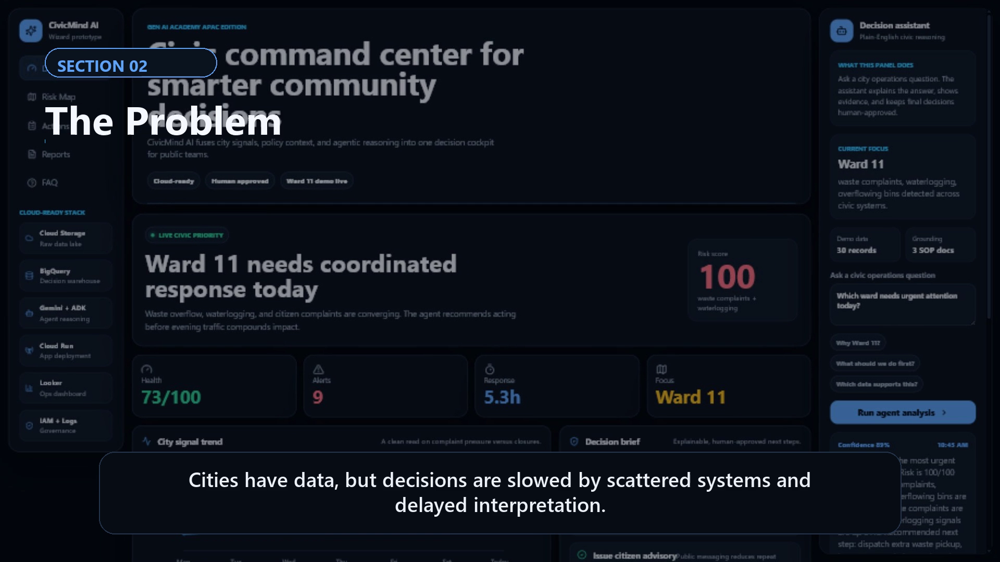
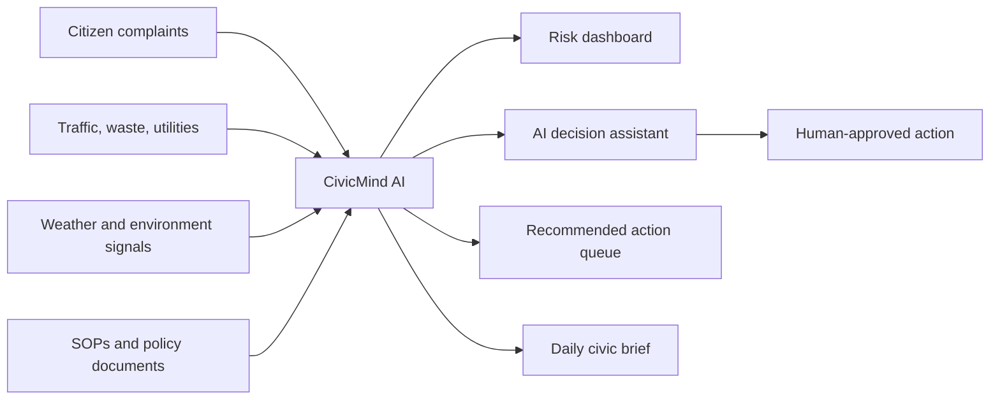
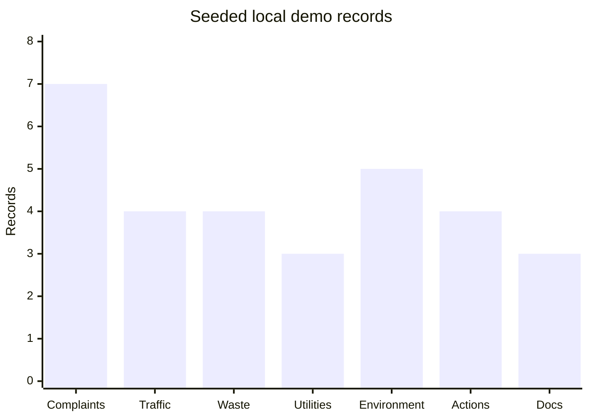
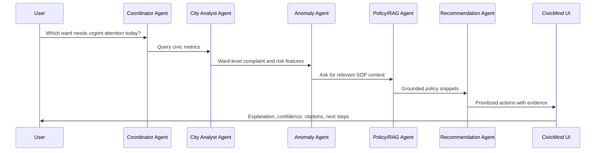

<p align="center">
  
</p>

<p align="center">
  
</p>

<p align="center">
  <a href="https://anuranjanjain.github.io/GenAIAPAC_C2/"></a>
  <a href="outputs/demo_video/CivicMind_AI_3min_Demo_Video.mp4"></a>
  
  
</p>

## Live Submission

**CivicMind AI** is a cloud-ready prototype for the Gen AI Academy APAC Cohort 2 problem statement **AI for Better Living and Smarter Communities**.

It turns scattered civic data into a premium decision cockpit where city teams can:

- spot the most urgent ward or community risk
- ask plain-English operational questions
- see evidence, confidence, and citations
- review recommended actions with owners and ETAs
- keep humans in the approval loop

| Artifact | Link |
| --- | --- |
| Live web app | [anuranjanjain.github.io/GenAIAPAC_C2](https://anuranjanjain.github.io/GenAIAPAC_C2/) |
| Full demo video | [outputs/demo_video/CivicMind_AI_3min_Demo_Video.mp4](outputs/demo_video/CivicMind_AI_3min_Demo_Video.mp4) |
| Submission deck | [outputs/CivicMind_AI_Prototype_Submission_Deck.pptx](outputs/CivicMind_AI_Prototype_Submission_Deck.pptx) |
| Submission PDF | [outputs/CivicMind_AI_Prototype_Submission_Deck.pdf](outputs/CivicMind_AI_Prototype_Submission_Deck.pdf) |
| Architecture docs | [docs/ARCHITECTURE.md](docs/ARCHITECTURE.md) |

## Demo Preview

<p align="center">
  <a href="outputs/demo_video/CivicMind_AI_3min_Demo_Video.mp4">
    
  </a>
</p>

<p align="center">
  <strong>Click the GIF to open the full narrated MP4 demo.</strong>
</p>

<p align="center">
  
</p>

## Problem

Cities and communities already generate huge operational signals: complaints, traffic events, waste logs, utility outages, environment readings, and department reports.

The real problem is slower decision-making:

- data lives in fragmented systems
- teams manually interpret spikes and patterns
- response priority is not always visible
- civic decisions need evidence and accountability
- public-facing updates are delayed

**CivicMind AI solves this by creating one AI-assisted decision layer for smarter community operations.**

## What The Prototype Shows



The demo scenario focuses on **Ward 11**, where heavy rain creates waste overflow, waterlogging, traffic pressure, and citizen complaints. The platform detects the pattern and recommends coordinated response.

## How To Use The App

| Step | View | What to do |
| --- | --- | --- |
| 1 | Dashboard | Start with the live civic priority and KPI strip. |
| 2 | Risk Map | Compare ward-level risk and inspect why Ward 11 is hot. |
| 3 | Actions | Review recommended interventions, owners, severity, ETA, and evidence. |
| 4 | Reports | Read the generated daily civic brief. |
| 5 | FAQ | Understand what changed, what data is inside, and how the prototype maps to cloud services. |
| 6 | Right assistant | Ask: `Which ward needs urgent attention today?` |

## Demo Data Coverage

The prototype runs without credentials using deterministic seeded civic data.



| Dataset | Records | Purpose |
| --- | ---: | --- |
| Citizen complaints | 7 | Complaint themes, severity, status, ward signals |
| Traffic events | 4 | Congestion and incident context |
| Waste collection | 4 | Missed pickups and bin fill level |
| Utility events | 3 | Outages, duration, affected users |
| Environment metrics | 5 | AQI, rainfall, flood risk |
| Recommended actions | 4 | Owners, ETAs, severity, evidence |
| SOP and policy docs | 3 | RAG grounding and decision citations |

**Total:** 30 records across 7 civic tables.

## Tech Stack

| Layer | Current prototype | Cloud-ready target |
| --- | --- | --- |
| Frontend | React, TypeScript, Vite | Cloud Run hosted web app |
| UI system | Premium dark dashboard, responsive rail/sidebar | Department role-based dashboards |
| Analytics | Local typed analytics functions | BigQuery tables and SQL feature views |
| Agents | Deterministic mock multi-agent flow | Gemini Enterprise Agent Platform + ADK |
| RAG | Local SOP snippets | Vertex AI Vector Search / RAG corpus |
| Dashboards | Native React visual panels | Looker / Looker Studio |
| Storage | Seeded TypeScript data | Cloud Storage raw data lake |
| Ops | Local build/test | Cloud Logging, Monitoring, IAM, Secret Manager |

## Agent Workflow



## Key Features

- **Premium executive dashboard** with a clean first impression
- **Ward 11 live priority story** for a clear demo narrative
- **Right-side decision assistant** with plain-English reasoning
- **FAQ tab** explaining the project, data, UI changes, and usage flow
- **Risk map** for ward-level prioritization
- **Action queue** with owner, severity, ETA, and impact
- **Daily brief** for stakeholder reporting
- **Cloud-ready adapter boundaries** for BigQuery, Gemini, ADK, RAG, and Cloud Run
- **Responsible AI defaults** with human approval, citations, confidence, and no PII in seeded data

## Local Setup

```bash
npm install
npm run dev
```

Build and test:

```bash
npm run test
npm run build
```

## Deployment

The live prototype is deployed through GitHub Pages from the `gh-pages` branch.

```bash
npm run build
```

The Vite base path is configured for:

```text
/GenAIAPAC_C2/
```

Live URL:

```text
https://anuranjanjain.github.io/GenAIAPAC_C2/
```

## Repository Map

```text
src/
  App.tsx                       Main app views and navigation
  styles.css                    Premium dark UI, motion, responsive layout
  data/demoData.ts              Seed civic dataset
  domain/analytics.ts           Risk and summary calculations
  domain/agents.ts              Mock multi-agent orchestration
  services/*Adapter.ts          Cloud-ready integration boundaries
docs/
  ARCHITECTURE.md               Architecture and cloud replacement plan
outputs/
  CivicMind deck + PDF          Submission artifacts
  demo_video/                   Narrated MP4, GIF, poster, subtitles
```

## Hackathon Alignment

| Judging dimension | How CivicMind AI addresses it |
| --- | --- |
| Innovation | Multi-agent civic decision intelligence for smarter communities |
| Technical depth | Typed analytics, agent orchestration, RAG boundary, deployment, tests |
| Practicality | Works as a city, campus, ward, district, or society operations cockpit |
| Impact | Faster insight, better prioritization, clearer response ownership |
| Scalability | Google Cloud-ready architecture with BigQuery, Gemini, ADK, Cloud Run |
| Responsible AI | Evidence, citations, confidence, auditability, and human approval |

## Final Pitch

> CivicMind AI turns scattered civic data into actionable community intelligence.
> It helps decision makers ask better questions, spot problems earlier, and act faster with evidence.

<p align="center">
  
</p>
